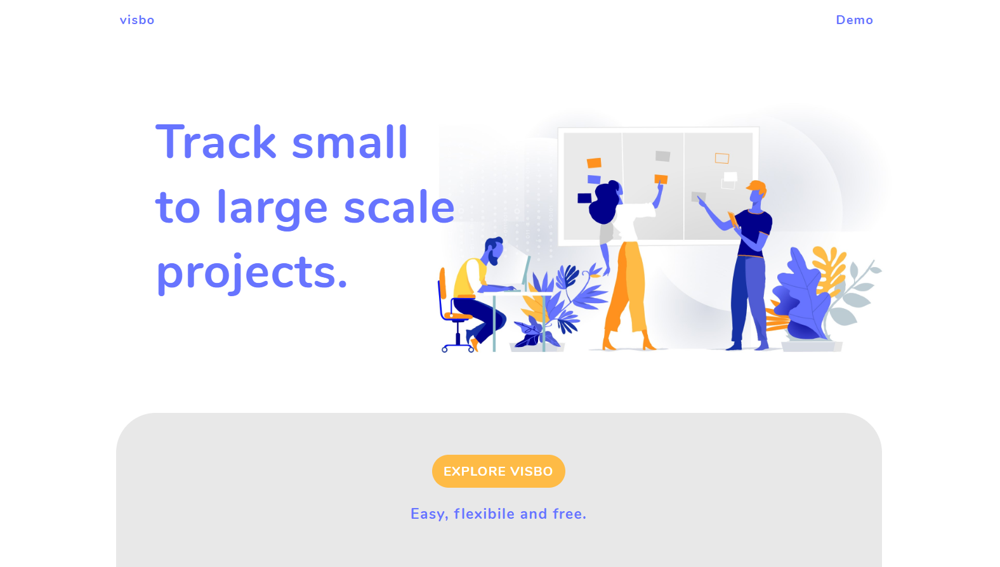

# Visbo

## Live: [Visbo](https://visbo.now.sh/)

## Description:
Simple Trello alternative app built with React, Node/Express and Postgres. User will be able to create an account and manage their "todos" using CRUD operations.

## In action:

### Landing Page

### View Demo page
    

### Search Places in your area

 
### Decide to Sign up

### Swipe left and right through your fav spots! 

## Tech Used:
* ReactJS
* React Router
* JSX
* NodeJS / ExpressJS
* Postgres / SQL
* HTML
* CSS
